# Atividades da Disciplina DCA0445

## Alunos: Victor Cortez Trigueiro de Oliveira, Isaac Moreira Barbosa	

## Introdução

Esta pagina foi escrita em linguagem markdown com o objetivo de apresentar as atividades propostas para a primeira unidade do curso de Processamento digital de imagens. **Para executar os codigos descritos abaixo é necessario salvar um arquivo .cpp contendo o codigo e, na mesma pasta, um arquivo [makefile](files/makefile). usando um terminal, execute a sequencia de comandos(linux):**

~~~~
$ make Nome_do_arquivo_cpp
$ ./Nome_do_arquivo_cpp
~~~~

## 2.2. Exercícios

* Utilizando o programa pixels.cpp como referência, implemente um programa regions.cpp. Esse programa deverá solicitar ao usuário as coordenadas de dois pontos *P1* e *P2* localizados dentro dos limites do tamanho da imagem e exibir que lhe for fornecida. Entretanto, a região definida pelo retângulo de vértices opostos definidos pelos pontos *P1* e *P2* será exibida com o negativo da imagem na região correspondente.

~~~~C++
/*
author: victor cortez
This program was made to exemplify image manipulation
using C++ and opencv on a linux.
It asks for an initial and final point and reverses the
(grayscale) image in the square between the points.
*/

#include <iostream>
#include <opencv2/opencv.hpp>

using namespace cv;
using namespace std;

typedef struct
{
    int x;
    int y;
} MyPoint;

int main(int, char **)
{
    Vec3b val; //unused

    Mat image;
    image = imread("biel.png", CV_LOAD_IMAGE_GRAYSCALE);
    if (!image.data)
    {
        cout << "nao abriu" << endl;
    }
    namedWindow("janela", WINDOW_AUTOSIZE);

    MyPoint pointA, pointB;
    cout << "type the x, y coordinates for point 1" << endl;
    cin >> pointA.x >> pointA.y;
    cout << "type the x, y coordinates for point 2" << endl;
    cin >> pointB.x >> pointB.y;

    for (int i = pointA.x; i < pointB.x; i++)
    {
        for (int j = pointA.y; j < pointB.y; j++)
        {
            image.at<uchar>(i, j) = 255-image.at<uchar>(i, j);
        }
    }

    imshow("janela", image);
    waitKey();
    imwrite("regionsOUT.png", image);
    waitKey();
    
    return 0;
}
~~~~

Exemplo de entrada e saída:

Entrada             |  Saída
:-------------------------:|:-------------------------:
  |  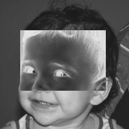

* Utilizando o programa pixels.cpp como referência, implemente um programa trocaregioes.cpp. Seu programa deverá trocar os quadrantes em diagonal na imagem. Explore o uso da classe Mat e seus construtores para criar as regiões que serão trocadas.

~~~~C++
/*
author: victor cortez
This program was made to swap the quadrants 1 with 4 and 2
with 3 in a grayscale image
*/

#include <iostream>
#include <opencv2/opencv.hpp>

using namespace cv;
using namespace std;

typedef struct
{
    int x;
    int y;
} MyPoint;

int main(int, char **)
{
    Vec3b val; //unused

    Mat image;
    image = imread("elon.png", CV_LOAD_IMAGE_GRAYSCALE);
    if (!image.data)
    {
        cout << "nao abriu" << endl;
    }
    namedWindow("janela", WINDOW_AUTOSIZE);

    cout << "the image has(h,w):" << endl;
    cout <<image.size().height << " " << image.size().width;

    //getting the first quadrant and saving in a rect structure
    //**the two ending coordinates are RELATIVE to the two
    //initial ones!
    //*the order is: columns, rows
    Rect rect = Rect(0,0, image.cols/2, image.rows/2);
    //or Rect rect(0,0, image.rows/2, image.cols/2)

    //this is actually referencing the main image. we need to COPY the roi.
    //used if we wanted to work on the original image.
    //Mat tempImg = image(rect);

    //getting a copy of the first quadrant
    Mat temp_img = image(rect).clone();

    //copy exerpt of 4th quadrant to 1st
    image(Rect(image.cols/2,image.rows/2,image.cols/2,image.rows/2))
    .copyTo(image(rect));

    //copy exerpt of 1st to 4th
    temp_img
    .copyTo(image(Rect(image.cols/2,image.rows/2,image.cols/2,image.rows/2)));

    //same with 2nd and 3rd quadrants
    rect = Rect(image.cols/2,0, image.rows/2, image.cols/2);
    temp_img = image(rect).clone();
    image(Rect(0,image.rows/2,image.cols/2,image.rows/2))
    .copyTo(image(rect));
    temp_img
    .copyTo(image(Rect(0,image.rows/2,image.cols/2,image.rows/2)));

    imshow("janela", image);
    waitKey();
    imwrite("trocaregioesOUT.png", image);

    
    return 0;
}
~~~~

Exemplo de entrada e saída:
Entrada             |  Saída
:-------------------------:|:-------------------------:
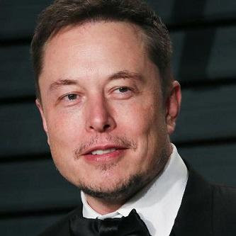  |  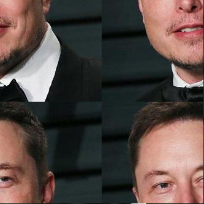

## 3.2 Exercícios
* Observando-se o programa labeling.cpp como exemplo, é possível verificar que caso existam mais de 255 objetos na cena, o processo de rotulação poderá ficar comprometido. Identifique a situação em que isso ocorre e proponha uma solução para este problema.

Para conseguir rotular mais de 255 objetos namesma imagem, iremos simplesmente utilizar o modulo 255 para repetir os tons de cinza ja usados quando ilustrarmos a imagem. Deste modo a contagem de cores continuará acontecendo corretamente e apenas a exibiçao será modificada.

* Aprimore o algoritmo de contagem apresentado para identificar regiões com ou sem buracos internos que existam na cena. Assuma que objetos com mais de um buraco podem existir. Inclua suporte no seu algoritmo para não contar bolhas que tocam as bordas da imagem. Não se pode presumir, a priori, que elas tenham buracos ou não.

Agora precisamos contar quantos objetos tem furos. para resolver esse problema, iremos primeiro ignorar os objetos que tocam a borda ao pintar a borda de branco e aplicar o algoritmo floodfill na borda, pintando os pixels brancos de preto.

Depois, iremos identificar os objetos com furos ao inverter o fundo da imagem, assim os furos continuarão pretos. sempre que encontrarmos um pixel preto, aplicaremos floodfill preto nos pixels adjacentes. neste caso, ignoraremos o nivel de cinza que representa o numero de imagens e mostraremos apenas o resultado após o floodfill.

Exemplo de entrada e saída:
Entrada             |  Saída
:-------------------------:|:-------------------------:
  |  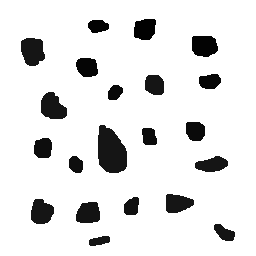
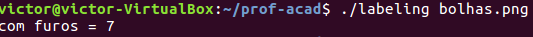

## 4.2. Exercícios

* Utilizando o programa histogram.cpp como referência, implemente um programa equalize.cpp. Este deverá, para cada imagem capturada, realizar a equalização do histogram antes de exibir a imagem. Teste sua implementação apontando a câmera para ambientes com iluminações variadas e observando o efeito gerado. Assuma que as imagens processadas serão em tons de cinza.

Pela impossibilidade de utilizar uma camera, iremos trabalhar com uma imagem. Escolhemos trabalhar com uma imagem em niveis de cinza.

~~~~C++
#include <iostream>
#include <opencv2/opencv.hpp>

using namespace cv;
using namespace std;

int main(int argc, char** argv){
  Mat image;
  int width, height;
  vector<Mat> planes;
  int nbins = 64;
  float range[] = {0, 256};
  const float *histrange = { range };
  bool uniform = true;
  bool acummulate = false;

    image = imread("elon.png", CV_LOAD_IMAGE_GRAYSCALE);
    if (!image.data)
    {
        cout << "nao abriu" << endl;
    }
    namedWindow("janela", WINDOW_AUTOSIZE);  
  
  width  = image.size().width;
  height = image.size().height;

  cout << "largura = " << width << endl;
  cout << "altura  = " << height << endl;

  int histw = nbins, histh = nbins/2;
  //equalization for one channel
  Mat histImg(histh, histw, CV_8UC1, Scalar(0,0,0));
  Mat histImgEQ(histh, histw, CV_8UC1, Scalar(0,0,0));
  Mat eq;
  equalizeHist(image, eq);
  Mat hist, histEQ;
    calcHist(&image, 1, 0, Mat(), hist, 1,
             &nbins, &histrange,
             uniform, acummulate);
    calcHist(&eq, 1, 0, Mat(), histEQ, 1,
             &nbins, &histrange,
             uniform, acummulate);

    cout << "chegou aqui";

    normalize(hist, hist, 0, histImg.rows, NORM_MINMAX, -1, Mat());
    normalize(histEQ, histEQ, 0, histImgEQ.rows, NORM_MINMAX, -1, Mat());

    histImg.setTo(Scalar(0));
    histImgEQ.setTo(Scalar(0));
    
    for(int i=0; i<nbins; i++){
      line(histImg,
           Point(i, histh),
           Point(i, histh-cvRound(hist.at<float>(i))),
           Scalar(255), 1, 8, 0);
      line(histImgEQ,
           Point(i, histh),
           Point(i, histh-cvRound(histEQ.at<float>(i))),
           Scalar(255), 1, 8, 0);
    }
    histImg.copyTo(image(Rect(0, 0       ,nbins, histh)));
    histImgEQ.copyTo(eq(Rect(0, histh   ,nbins, histh)));
    imshow("image", image);
    imshow("eq", eq);
    imwrite("equalize.png", image);
    imwrite("equalizeeq.png", eq);
    waitKey();

  return 0;
}

~~~~

Exemplo de entrada e saída:

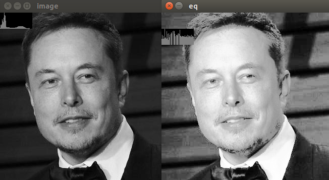

* Utilizando o programa histogram.cpp como referência, implemente um programa motiondetector.cpp. Este deverá continuamente calcular o histograma da imagem (apenas uma componente de cor é suficiente) e compará-lo com o último histograma calculado. Quando a diferença entre estes ultrapassar um limiar pré-estabelecido, ative um alarme. Utilize uma função de comparação que julgar conveniente.

Iremos exemplificar o funcionamento com as imagens anteriores.

~~~~C++
int main(int argc, char** argv){
  Mat image,oldImage;
  int width, height;
  vector<Mat> planes;
  int nbins = 64;
  float range[] = {0, 256};
  const float *histrange = { range };
  bool uniform = true;
  bool acummulate = false;

//com uma webcam estariamos comparando o frame anterior
//neste caso estamos comparando duas imagens.
    oldImage = imread("elon.png", CV_LOAD_IMAGE_GRAYSCALE);
    if (!oldImage.data)
    {
        cout << "nao abriu" << endl;
    }
    image = imread("equalizeeq.png", CV_LOAD_IMAGE_GRAYSCALE);
    if (!image.data)
    {
        cout << "nao abriu" << endl;
    }
    namedWindow("janela", WINDOW_AUTOSIZE);  
  
  width  = image.size().width;
  height = image.size().height;

  cout << "largura = " << width << endl;
  cout << "altura  = " << height << endl;

  int histw = nbins, histh = nbins/2;
  
  Mat histImg(histh, histw, CV_8UC1, Scalar(0,0,0));
  Mat hist, oldHist;
  calcHist(&image, 1, 0, Mat(), hist, 1,
             &nbins, &histrange,
             uniform, acummulate);
  

  normalize(hist, hist, 0, histImg.rows, NORM_MINMAX, -1, Mat());
  calcHist(&oldImage, 1, 0, Mat(), oldHist, 1,
             &nbins, &histrange,
             uniform, acummulate);

  normalize(oldHist, oldHist, 0, histImg.rows, NORM_MINMAX, -1, Mat());

  histImg.setTo(Scalar(0));

  for(int i=0; i<nbins; i++){
      line(histImg,
           Point(i, histh),
           Point(i, histh-cvRound(hist.at<float>(i))),
           Scalar(255), 1, 8, 0);
    }
    histImg.copyTo(image(Rect(0, 0       ,nbins, histh)));

    //at the end of the printing process, check if the two images
    //correlate.
    if(motionDetected(hist, oldHist)){
      cout << "ALARM"<<endl;
    }
  return 0;
}
~~~~

Com algumas modificaçoes no codigo anterior podemos chamar uma funçao de comparação ao fim de cada loop.

~~~~C++
bool motionDetected(Mat beforeHist, Mat afterHist){
  //comparing histogram based on correlation.
  double correl = compareHist(beforeHist, afterHist, CV_COMP_CORREL);
  cout << correl << endl;
  if(correl < 0.98){
    return true;
  }else{
    return false;
  }
}
~~~~

## 5.2. Exercícios

* Utilizando o programa exemplos/filtroespacial.cpp como referência, implemente um programa laplgauss.cpp. O programa deverá acrescentar mais uma funcionalidade ao exemplo fornecido, permitindo que seja calculado o laplaciano do gaussiano das imagens capturadas. Compare o resultado desse filtro com a simples aplicação do filtro laplaciano.

Para a resolução desse problema, a estratégia adotada foi utilizar uma nova máscara (lpgss) 5x5 obtida através da derivada a segunda do gradiente do gaussiano e aplicando-a diretamente, o efeito resultante é o laplaciano do gaussiano. 

~~~~C++
#include <iostream>
#include <opencv2/opencv.hpp>

using namespace cv;
using namespace std;

void printmask(Mat &m){
  for(int i=0; i<m.size().height; i++){
    for(int j=0; j<m.size().width; j++){
      cout << m.at<float>(i,j) << ",";
    }
    cout << endl;
  }
}

void menu(){
  cout << "\npressione a tecla para ativar o filtro: \n"
	"a - calcular modulo\n"
    "m - media\n"
    "g - gauss\n"
    "v - vertical\n"
	"h - horizontal\n"
    "l - laplaciano\n"
    "c - laplaciano do gaussiano\n"
    "c - laplaciano do gaussiano\n"
	"esc - sair\n";
}

int main(int argvc, char** argv){
  VideoCapture video;
  float media[] =   {1,1,1,
				    1,1,1,
				    1,1,1};
  float gauss[] =   {1,2,1,
				    2,4,2,
				    1,2,1};
  float horiz[] =   {-1,0,1,
					-2,0,2,
					-1,0,1};
  float vert[] =    {-1,-2,-1,
					0,0,0,
					1,2,1};
  float lap[] =     {0,-1,0,
					-1,4,-1,
					0,-1,0};
//Mascara 5x5 adquirida através da derivada a segunda do gaussiano
  float lpgss[] =   {0,0,1,0,0,
                     0,1,2,1,0,
                     1,2,-16,2,1,
                     0,1,2,1,0,
                     0,0,1,0,0};

  Mat cap, frame, frame32f, frameFiltered;
  Mat mask(3,3,CV_32F), mask1;
  Mat result, result1;
  int absolut;
  char key;

  video.open(0);
  
  if(!video.isOpened())
    return -1;
  
  namedWindow("filtroespacial",1);

  mask = Mat(3, 3, CV_32F, media);
  scaleAdd(mask, 1/9.0, Mat::zeros(3,3,CV_32F), mask1);
  swap(mask, mask1);
  absolut=1; // calcs abs of the image

  menu();
  for(;;){
    video >> cap;
    cvtColor(cap, frame, CV_BGR2GRAY);
    flip(frame, frame, 1);
    imshow("original", frame);
    frame.convertTo(frame32f, CV_32F);
    filter2D(frame32f, frameFiltered, frame32f.depth(), mask, Point(1,1), 0);
    if(absolut){
      frameFiltered=abs(frameFiltered);
    }
    frameFiltered.convertTo(result, CV_8U);
    imshow("filtroespacial", result);
    key = (char) waitKey(10);
    if( key == 27 ) break; // esc pressed!
    switch(key){
    case 'a':
	  menu();
      absolut=!absolut;
      break;
    case 'm':
	  menu();
      mask = Mat(3, 3, CV_32F, media);
      scaleAdd(mask, 1/9.0, Mat::zeros(3,3,CV_32F), mask1);
      mask = mask1;
      printmask(mask);
      break;
    case 'g':
	  menu();
      mask = Mat(3, 3, CV_32F, gauss);
      scaleAdd(mask, 1/16.0, Mat::zeros(3,3,CV_32F), mask1);
      mask = mask1;
      printmask(mask);
      break;
    case 'h':
	  menu();
      mask = Mat(3, 3, CV_32F, horiz);
      printmask(mask);
      break;
    case 'v':
	  menu();
      mask = Mat(3, 3, CV_32F, vert);
      printmask(mask);
      break;
    case 'l':
	  menu();
      mask = Mat(3, 3, CV_32F, lap);
      printmask(mask);
      break;
    case 'c':
      menu();
      //aplicação direta do filtro 5x5
      mask = Mat(5, 5, CV_32F, lpgss);
      printmask(mask);
      break;  
    default:
      break;
    }
  }
  return 0;
}
~~~~

Exemplo de entrada e saída:

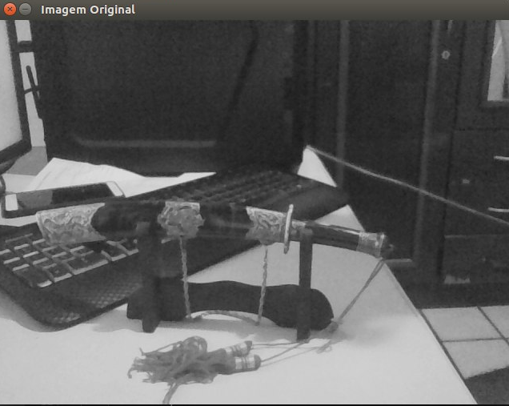 

imagem original

filtro laplaciano

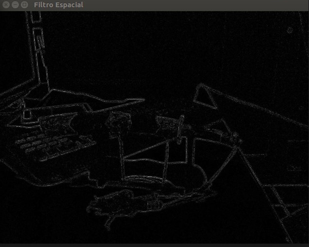

filtro gaussiano

## 6.1. Exercícios

todo

## 7.2. Exercícios

todo

* Utilizando o programa exemplos/dft.cpp como referência, implemente o filtro homomórfico para melhorar imagens com iluminação irregular. Crie uma cena mal iluminada e ajuste os parâmetros do filtro homomórfico para corrigir a iluminação da melhor forma possível. Assuma que a imagem fornecida é em tons de cinza.

O filtro homomórfico utilizado foi o seguinte:

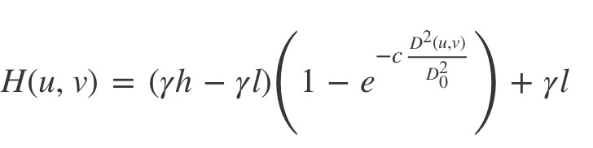

Onde:

yL: Determina a contribuição das baixas frequências (iluminância)
yH: Determina a contribuição das Altas frequências (reflequitância)
c:  Constante que determna a transição (curvatura) entre yL e yH
D0: Frequência de corte.

A seguir temos o código comentado, os valores ininiciais utilizados no filtro foram selecionados após uma série de testes:
~~~~C++
#include <iostream>
#include <opencv2/opencv.hpp>
#include <opencv2/imgproc/imgproc.hpp>

#define RADIUS 20

using namespace cv;
using namespace std;

Mat imaginaryInput, complexImage, multsp;
Mat padded, filter;
Mat image, tmp;
Mat_<float> realInput, zeros;
vector<Mat> planos;

// valores ideais dos tamanhos da imagem
// para calculo da DFT
int dft_M, dft_N;

double yL, yH, c, d0;

 int c_slider=1;
 int Do_slider=1;
 int yL_slider=1;
 int yH_slider=1;

// troca os quadrantes da imagem da DFT
void deslocaDFT(Mat& image ){
  Mat tmp, A, B, C, D;

  // se a imagem tiver tamanho impar, recorta a regiao para
  // evitar cópias de tamanho desigual
  image = image(Rect(0, 0, image.cols & -2, image.rows & -2));
  int cx = image.cols/2;
  int cy = image.rows/2;

  // reorganiza os quadrantes da transformada
  // A B   ->  D C
  // C D       B A
  A = image(Rect(0, 0, cx, cy));
  B = image(Rect(cx, 0, cx, cy));
  C = image(Rect(0, cy, cx, cy));
  D = image(Rect(cx, cy, cx, cy));

  // A <-> D
  A.copyTo(tmp);  D.copyTo(A);  tmp.copyTo(D);

  // C <-> B
  C.copyTo(tmp);  B.copyTo(C);  tmp.copyTo(B);
}

void on_trackbar_homomorfico(int, void*){
    //garante maior otimização dos valores informados 
    //pelo usuário no filtro
    if(c_slider == 0)
      c_slider=1;
    
    if(Do_slider == 0)
      Do_slider=1;
    
   if(yL_slider == 0)
     yL_slider=1;
   
    if(yH_slider == 0)
      yH_slider=1;
    
  //filtro frequencial
  c = (double) c_slider/100 ;
  d0 = (double) Do_slider/4 ;
  yL = (double) yL_slider/100 ;
  yH = (double) yH_slider/100 ;

  // limpa o array de matrizes que vao compor a
  // imagem complexa
  planos.clear();
  // cria a componente real
  realInput = Mat_<float>(padded);
  // insere as duas componentes no array de matrizes
  planos.push_back(realInput);
  planos.push_back(zeros);

  // combina o array de matrizes em uma unica
  // componente complexa
  merge(planos, complexImage);

  // calcula o dft
  dft(complexImage, complexImage);

  // realiza a troca de quadrantes
  deslocaDFT(complexImage);

  // calculo do filtro homomorfico
  for(int i=0; i<dft_M; i++){
    for(int j=0; j<dft_N; j++)
        tmp.at<float> (i,j) = (yH-yL)*(1.0 - exp(-c* ((i-dft_M/2)*(i-dft_M/2)+(j-dft_N/2)*(j-dft_N/2))/(d0*d0) )) + yL;
    
  }

  // cria a matriz com as componentes do filtro e junta
  // ambas em uma matriz multicanal complexa
  Mat comps[]= {tmp, tmp};
  merge(comps, 2, filter);

  // aplica o filtro frequencial
  mulSpectrums(complexImage,filter,complexImage,0);

  // troca novamente os quadrantes
  deslocaDFT(complexImage);
  // calcula a DFT inversa
  idft(complexImage, complexImage);
  // limpa o array de planos
  planos.clear();
  // separa as partes real e imaginaria da
  // imagem filtrada
  split(complexImage, planos);
  // normaliza a parte real para exibicao
  normalize(planos[0], planos[0], 0, 1, CV_MINMAX);

  imshow("Homomorfico", planos[0]);
}

int main(){
  // guarda tecla capturada
  char key;

  namedWindow("Original", WINDOW_NORMAL);
  namedWindow("Homomorfico", WINDOW_NORMAL);

  // Salva a imagem na variavel image
  image = imread("flash.jpg", CV_LOAD_IMAGE_GRAYSCALE);
  if(!image.data)
    cout << "A imagem nao pode ser aberta" << endl;
        
  // Mostra a imagem original
  imshow("Original", image);

  // identifica os tamanhos otimos para
  // calculo do FFT
  dft_M = getOptimalDFTSize(image.rows);
  dft_N = getOptimalDFTSize(image.cols);

  // realiza o padding da imagem
  copyMakeBorder(image, padded, 0,
    dft_M - image.rows, 0,
    dft_N - image.cols,
    BORDER_CONSTANT, Scalar::all(0));

  // parte imaginaria da matriz complexa (preenchida com zeros)
  zeros = Mat_<float>::zeros(padded.size());

  // prepara a matriz complexa para ser preenchida
  complexImage = Mat(padded.size(), CV_32FC2, Scalar(0));

  // a função de transferência (filtro frequencial) deve ter o
  // mesmo tamanho e tipo da matriz complexa
  filter = complexImage.clone();

  // cria uma matriz temporária para criar as componentes real
  // e imaginaria do filtro ideal
  tmp = Mat(dft_M, dft_N, CV_32F);

  createTrackbar( "yH", "Homomorfico",
  &yH_slider, 100, on_trackbar_homomorfico);

  createTrackbar( "yL", "Homomorfico",
  &yL_slider, 100, on_trackbar_homomorfico);

  createTrackbar( "D0", "Homomorfico",
  &Do_slider, 100, on_trackbar_homomorfico);

  createTrackbar( "C", "Homomorfico",
  &c_slider, 100, on_trackbar_homomorfico);

  on_trackbar_homomorfico(0, NULL);

  while(true){
    key = (char) waitKey(10);
    if( key == 27 ) // Pressione ESC
        break; 
  }

  return 0;
}
~~~~

A imagem utilizada foi a seguinte:

## 8.3. Exercícios

todo

## 9.2. Exercícios

* Utilizando o programa kmeans.cpp como exemplo prepare um programa exemplo onde a execução do código se dê usando o parâmetro nRodadas=1 e inciar os centros de forma aleatória usando o parâmetro KMEANS_RANDOM_CENTERS ao invés de KMEANS_PP_CENTERS. Realize 10 rodadas diferentes do algoritmo e compare as imagens produzidas. Explique porque elas podem diferir tanto.

Sempre haverá variação no resultado final da figura, mesmo que usemos o algorítimo proposto por Arthur, kmeans++, pois apesar de existir um controle maior na escolha inicial dos centros, o valor inicial para inicio do algorítimo ainda é aleatorio. Podemos reproduzir 10 imagens adicionando um laço for ao redor do codigo e fazendo algumas pequenas modificações:

~~~~C++

#include <opencv2/opencv.hpp>
#include <cstdlib>

using namespace cv;

int main( int argc, char** argv ){
for(int etapa = 0; etapa<10; etapa++){
  int nClusters = 10;
  Mat rotulos;
  int nRodadas = 1;
  Mat centros;

  if(argc!=3){
	exit(0);
  }
  
  Mat img = imread( argv[1], IMREAD_COLOR);
/*
* matriz (imagem) cujo numero de linhas é igual ao numero de pixels da imagem de entrada
* (img.cols * img.rows) e 3 colunas para armazenar R,G,B desses pixels. aqui ela é  
* inicializada com 0s
*/
  Mat samples(img.rows * img.cols, 3, CV_32F);

/*
* passing the pixels to the samples matrix
*/
  for( int y = 0; y < img.rows; y++ ){
    for( int x = 0; x < img.cols; x++ ){
      for( int z = 0; z < 3; z++){
        samples.at<float>(y + x*img.rows, z) = img.at<Vec3b>(y,x)[z];
	  }
	}
  }
  
  kmeans(samples,
		 nClusters,
		 rotulos,
		 TermCriteria(TermCriteria::COUNT + TermCriteria::EPS, 10000, 0.0001),
		 nRodadas,
		 KMEANS_PP_CENTERS,
		 centros );

  Mat rotulada( img.size(), img.type() );
  for( int y = 0; y < img.rows; y++ ){
    for( int x = 0; x < img.cols; x++ ){ 
	  int indice = rotulos.at<int>(y + x*img.rows,0);
	  rotulada.at<Vec3b>(y,x)[0] = (uchar) centros.at<float>(indice, 0);
	  rotulada.at<Vec3b>(y,x)[1] = (uchar) centros.at<float>(indice, 1);
	  rotulada.at<Vec3b>(y,x)[2] = (uchar) centros.at<float>(indice, 2);
	}
  }

  imshow( "clustered image", rotulada );
	std::string nome = argv[2];
	nome.append(std::to_string(etapa));
	nome.append(".jpeg");
  imwrite(nome, rotulada);
  waitKey( 0 );
}

}

~~~~

O resultado final sao 10 imagens ligeiramente diferentes. Note que mudamos o numero de clusters para 10, assim, pequenas mudanças na decisão do cluster mais proximo podem ser mais bem percebidas. Se mudarmos o trecho KMEANS_PP_CENTERS para uma escolha aleatoria dos centros usando KMEANS_RANDOM_CENTERS, obtemos uma variação muito maior nas imagens de saída pois cada centro irá se deslocar um numero limitado de vezes antes do fim do algorítmo, e como eles sao inicializados com valores aleatórios, acabam chegando ao final da computação com valores diferentes. Podemos exemplificar esse resultado abaixo:

Exemplo de saídas:
Imagem 1             |  Imagem 2
:-------------------------:|:-------------------------:
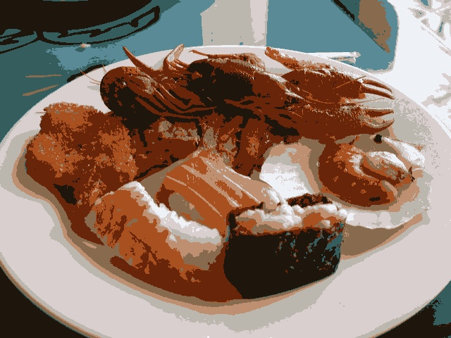  |  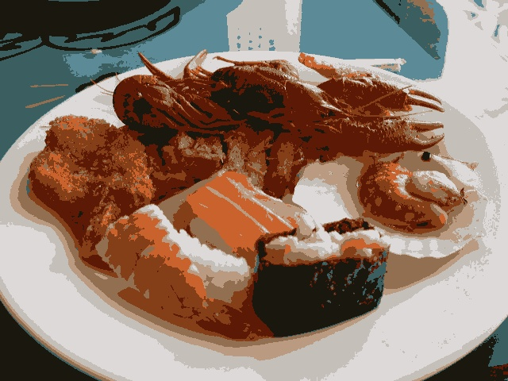
